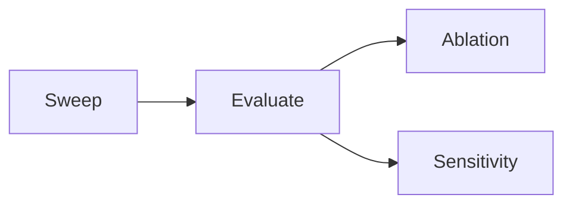

# 工作流规范与阶段定义

## 1. 运行模式

| 模式 | 命令示例 | 说明 |
|------|----------|------|
| `pipeline` | `bash scripts/workflow.sh [pipeline] [SWEEP_ID]` | 全流程: sweep -> evaluate -> pipeline_tasks |
| `sweep` | `bash scripts/workflow.sh sweep` | 仅超参搜索 |
| `evaluate` | `bash scripts/workflow.sh evaluate SWEEP_ID` | 仅多随机种子评估 |
| `ablation` | `bash scripts/workflow.sh ablation SWEEP_ID` | 消融实验 |
| `sensitivity` | `bash scripts/workflow.sh sensitivity SWEEP_ID` | 参数敏感性 |
| `dry-run` | `bash scripts/workflow.sh dry-run [SWEEP_ID]` | 预览命令，不执行 |
| `notify` | `bash scripts/workflow.sh notify [SWEEP_ID]` | 启用邮件通知 |

## 2. 核心流程



### Sweep - 超参数搜索

- **触发**: `task_name=sweep` 或 `pipeline` 且无 `target_sweep_id`
- **文件**: [`src/tasks/sweep.py`](src/tasks/sweep.py:1)
- **流程**:
  1. `CommandBuilder.build_wandb_sweep_command()` 创建 W&B sweep
  2. `TmuxService.create_workers_session()` 为每个 GPU 启动 `wandb agent`
  3. 等待 sweep FINISHED
  4. 保存 `status_{sweep_id}.yaml`
  5. 发布 W&B source artifact: `code_sweep_{sweep_id}:latest`
- **安全**: dry-run 不发布 source artifact；真实发布默认拒绝覆盖同 sweep id artifact

### Evaluate - 多随机种子评估

- **触发**: `pipeline_tasks` 中 `type=evaluate` 或 `task_name=evaluate`
- **文件**: [`src/tasks/evaluate.py`](src/tasks/evaluate.py:1)
- **流程**:
  1. 等待 sweep FINISHED
  2. `WandbService.find_top_n_runs(sweep, metric, top_n)` 获取 top-N runs
  3. 每个 rank 独立建沙盒、提取 overrides、重跑多 seed
  4. 聚合 per-rank metrics 和 checkpoints
  5. 保存 `optimized_results_{sweep_id}.json/.csv` 与 `eval_checkpoints_{sweep_id}.json`
  6. 发送 Eval 邮件
- **配置项**:
  - `evaluate_task.top_n`: 评估前 N 个参数（默认 2，最大 3）
  - `evaluate_task.num_seeds`: 每个参数重跑种子数
  - `evaluate_task.timeout_secs`: 超时秒数（默认 3600，0=无限制）
  - `evaluate_task.mode`: `rerun` | `resume`

### Ablation - 消融实验

- **触发**: `task_name=ablation` 或 `pipeline_tasks` 中 `type=ablation`
- **文件**: [`src/tasks/ablation.py`](src/tasks/ablation.py:1)
- **流程**:
  1. 前置检查: sweep 必须存在
  2. `ensure_evaluate_results()` 无 evaluate 报告则自动运行（skip_email）
  3. 使用 `ablation_task.eval_rank` 获取 rank-N 最优参数
  4. 解析 `ablation_task.components`
  5. 并行或串行执行所有组件
  6. 保存 `logs/final_reports/ablation_<sweep_id>_rankN/<component>.json`
  7. 发送消融邮件，标题和本地 markdown 使用完整 sweep id + rank
- **配置项**:
  - `ablation_task.eval_rank`: 使用第 N 优参数
  - `ablation_task.mode`: `rerun` | `resume`
  - `ablation_task.optimized_metric`: rank 选择指标
  - `ablation_task.parallel`: 是否并行
  - `ablation_task.num_seeds`, `seed_start`, `timeout_secs`
  - `ablation_task.components`: 消融组件列表

### Sensitivity - 参数敏感性分析

- **触发**: `task_name=sensitivity` 或 `pipeline_tasks` 中 `type=sensitivity`
- **文件**: [`src/tasks/sensitivity.py`](src/tasks/sensitivity.py:1)
- **流程**:
  1. 前置检查: sweep 存在
  2. `ensure_evaluate_results()` 自动获取 evaluate 基线
  3. 使用 `sensitivity_task.eval_rank` 获取 rank-N 最优参数
  4. 解析 `sensitivity_task.sensitivities`（兼容单个 `param_grid`）
  5. `validate_config_keys()` 校验参数 key
  6. `max_grid_combinations` 上限检查
  7. 并行执行所有 combo × seeds
  8. 按 study 收集结果，force refresh + 短重试
  9. 绘制无 title 的 1D/2D 图，保存 PNG/PDF
  10. 保存 `logs/final_reports/sensitivity_<sweep_id>_rankN.json` 与同名目录
  11. 发送敏感性邮件，checkpoint 只取当前 rank
- **配置项**:
  - `sensitivity_task.eval_rank`: 使用第 N 优参数
  - `sensitivity_task.mode`: `rerun` | `resume`
  - `sensitivity_task.optimized_metric`: rank 选择指标
  - `sensitivity_task.sensitivities`: 多 study 列表
  - `sensitivity_task.param_grid`: 单 study 兼容入口
  - `sensitivity_task.primary_metric`, `figure_width`, `figure_dpi`

## 3. W&B Group 命名规范

| 任务 | 格式 | 示例 |
|------|------|------|
| evaluate | `eval/{sweep_id}/top-{rank}` | `eval/abc123/top-1` |
| ablation | `ablation/{sweep_id}/[r{rank}/]{component}` | `ablation/abc123/r2/no_lin1_bn` |
| sensitivity | `sensitivity/{sweep_id}/[r{rank}/]{study}` | `sensitivity/abc123/r2/width_sensitivity` |

## 4. Source Snapshot 与版本安全

- source artifact 名称固定为 `code_sweep_<sweep_id>:latest`。
- 默认 `workflow.snapshot.allow_source_overwrite=false`，同 sweep id 再发布 source artifact 会失败，防止旧 sweep 被新代码污染。
- artifact 内含 `source_manifest.json`，记录 git commit、dirty 状态、文件 hash。
- `scripts/rsync.sh` 同步当前源码到远端不会改变旧 sweep 的 payload；旧 sweep 的 evaluate/ablation/sensitivity 继续拉取旧 artifact。
- `workflow.snapshot.legacy_config_fallbacks=true` 只对没有 manifest 的旧 artifact 补运行期配置。新 artifact 缺配置直接报错。
- 训练 payload 在沙盒中执行，但 `paths.log_dir`、`paths.data_dir`、`logger.wandb.save_dir` 指回宿主主仓库，便于收集日志/checkpoints。

## 5. 断点恢复规则

1. `pipeline` 运行时，`.pipeline_progress_{sweep_id}` 记录已完成阶段，重新运行自动跳过。
2. 显式传入 `target_sweep_id` 时，全部 pipeline stages 强制重跑。
3. `ablation` / `sensitivity` 独立模式不受 pipeline 进度影响。

## 6. 超时与清理规范

| 层级 | 控制者 | 默认值 | 行为 |
|------|--------|--------|------|
| Shell | `timeout` 命令 | 300s | 整个进程 SIGTERM |
| Evaluate Python | `wait_for_session_with_timeout()` | 3600s | SIGINT tmux -> graceful kill |
| Ablation Python | `wait_for_session_with_timeout()` | 600s | SIGINT tmux -> graceful kill |
| Sensitivity Python | `wait_for_session_with_timeout()` | 600s | SIGINT tmux -> graceful kill |

## 7. 邮件规范

`evaluate` / `ablation` / `sensitivity` 会发送邮件；`sweep` 不发送邮件。所有邮件包含:
- 完整 Sweep ID、Sweep URL、Run URL
- 最优配置（`rank N best`）
- 测试指标（mean ± std，单 seed std=0.0）
- 复现脚本（`seed=[42,43,44]` 格式）
- Group URL
- 当前 rank 的 checkpoint 路径列表

邮件 markdown:
- Eval: `logs/mail/eval/<project>_<sweep_id>_<ts>.md`
- Ablation: `logs/mail/ablation/<project>_<sweep_id>_rankN_<ts>.md`
- Sensitivity: `logs/mail/sensitivity/<project>_<sweep_id>_rankN_<ts>.md`

## 8. 回归命令

```bash
bash tests/integration/test_four_modes.sh
pytest tests/unit/test_sandbox_service.py tests/unit/test_base_task_snapshot.py tests/unit/test_email_templates.py tests/unit/test_workflow_task.py -q
```
